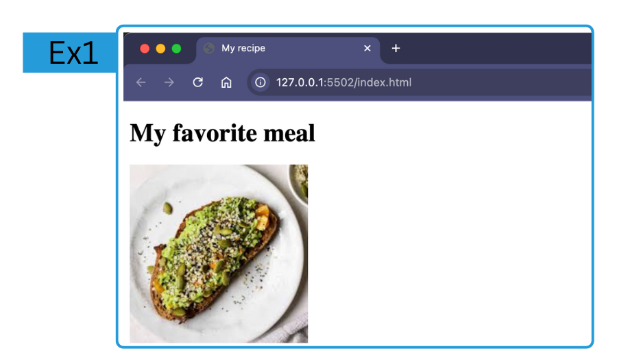

# LAB: My Recipe 
**HTML - Week 2**
--

## Exercice 1: header-setup

In this exercice you will manipulate the following tags:  
- `<title>`  
- `<h1>`  
- ``  

The goal is to reproduce this:  


⚠️ make sure you are in the right branch with `git checkout header-setup`

#### 1. Title
Add a `<title></title>` that will be read my the search engines.  

#### 2. Highest heading
Add a `<h1></h1>`for the document/page. It should be placed at the top of the `<body></body>` element.  
This will be the title of the page once you are visiting it.  
You can name it "..... recipe", --> `<h1>..... recipe</h1>`  


#### 3. Image
``

### GIT

Now if you are satisfied by your code, you can commit, and publish it with:  
```bash
 git add .
 git commit -m "created the header section"
 git push
```

### Next exercice
Change branch and checkout the `ingredients` branch, with:
`git checkout ingredients`

