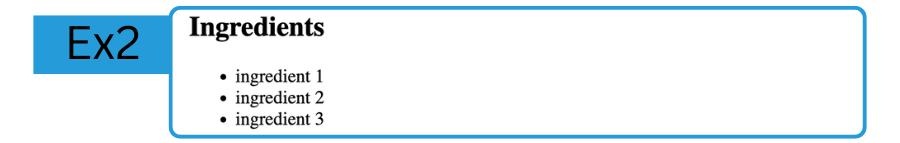

# LAB: My Recipe 
**HTML - Week 2**
--

## Exercice 2: Unordered list of ingredients

In this exercice, inside of the `<body></body>` tag, you will manipulate the following tags:  
- `<h2>`  
- `<ul>`  
- `<li>`  

The goal is to reproduce this:  


⚠️ make sure you are in the right branch with `git checkout ingredients`

#### 1. Heading
Add a `<h2></h2>` heading to create the title for the list.  

#### 2. Unordered list
Add a `<ul></ul>`. And inside of it, add as many `<li></li>` as needed.


### GIT

Now if you are satisfied by your code, you can commit, and publish it with:  
```bash
 git add .
 git commit -m "created the ingredients section"
 git push
```

### Next exercice
Change branch and checkout the `steps` branch, with:
`git checkout steps`

