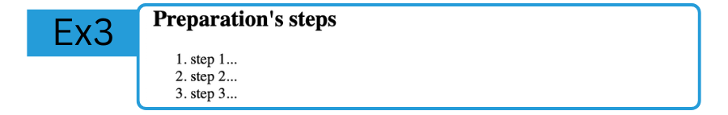

# LAB: My Recipe 
**HTML - Week 2**
--

## Exercice 3: Ordered list of steps for preparation

In this exercice you will manipulate the following tags:  
- `<h2>`  
- `<ol>`  
- `<li>`  

The goal is to reproduce this:


#### 1. Heading
Add a `<h2></h2>` heading to create the title for the list.  

#### 2. Ordered list
Add a `<ol></ol>`. And inside of it, add as many `<li></li>` as needed.


### GIT

Now if you are satisfied by your code, you can commit, and publish it with:  
```bash
 git add .
 git commit -m "created the steps section"
 git push
```

### Next exercice
Change branch and checkout the `links` branch, with:
`git checkout links`