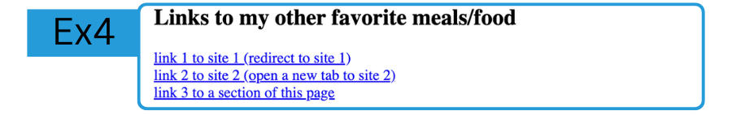

# LAB: My Recipe 
**HTML - Week 2**
--

## Exercice 4: Send people to other websites

In this exercice you will manipulate the following tags:  
- `<h2>`  
- `<a>`  
- `</br>`  

The goal is to reproduce this:  


⚠️ make sure you are in the right branch with `git checkout links`

#### 1. Heading
Add a `<h2></h2>` heading to create the title for the list.  

#### 2. Links
On internet, search two other recipes you like.
You will add `<a href="url to the new recipe" target=""></a>` to send users to these other recipes' page 
  | 1. the first link should redirect the user to the new recipe, **staying on the same tab**
  | 2. the second link should redirect the user to the new recipe, **opening a new tab**

- To ensure the user will be redirected in a new tab, target's value has to be `_blank`
- To ensure the links are not on the same line, you need to use `</br>`to break line


### GIT

Now if you are satisfied by your code, you can commit, and publish it with:  
```bash
 git add .
 git commit -m "created the links section"
 git push
```

### Next exercice
Change branch and checkout the `paragraph` branch, with:
`git checkout paragraph`
