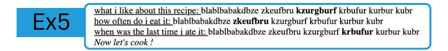

# LAB: My Recipe 
**HTML - Week 2**
--

## Exercice 4: Talk about your own recipe

In this exercice, inside of the `<body></body>`tag, you will manipulate the following tags:  
- `<p>`  
- `<u>`  
- `<b>`  
- `<i>`  
- `</br>`  

The goal is to reproduce this:


#### 1. Paragraph
You will add a `<p></p>`. Then you will nest the rest inside of this paragraph tag.

### 1. Paragraph - Answer questions

In order to have text content and do text formating, you will write something about:
- What I like about my recipe
- How often I eat this meal
- When was the last time I ate this meal

BUT, you will have to respect the following format rules:
1. you need to underline the questions you will answer with `<u></u>`
2. every question-answer has to break line with `</br>`
3. every answer needs to be a full sentence, but you will render the most important part of the answer as bold with `<b></b>`

### 1. Paragraph - Encouragement slogan

Then, you will once again break line with `</br>`,  
and add an italic encouragement slogan with `<i></i>`


### GIT

Now if you are satisfied by your code, you can commit, and publish it with:  
```bash
 git add .
 git commit -m "created the paragraph section"
 git push
```

### Next exercice
Now you've finished all sections, you will return to the main branch readme.md instructions and resume et the merge and publish section of the document.